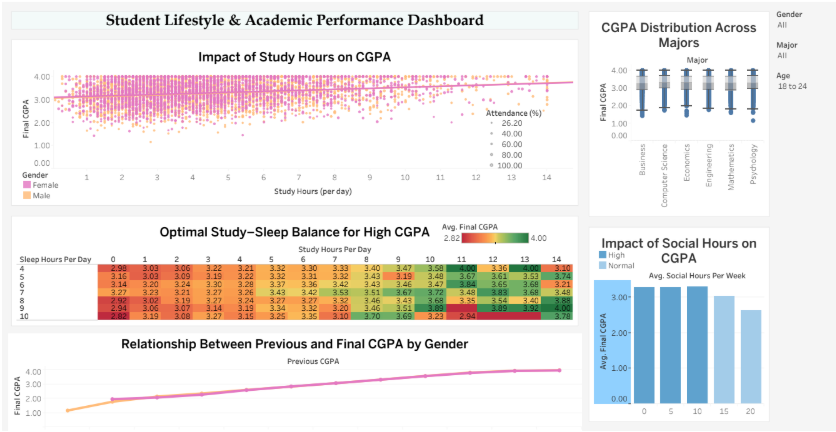

# Student Lifestyle & Academic Performance Dashboard

An interactive Tableau dashboard exploring the relationship between student lifestyle factors and academic performance.

## Overview

This project analyzes student academic and lifestyle data to explore how factors such as study hours, attendance, sleep duration, social activity, previous CGPA, and academic major relate to final academic performance.

The dashboard was developed as part of an Advanced Data Science course.

## Tools & Technologies

- Tableau
- Data Visualization
- Exploratory Data Analysis
- Calculated Fields
- Data Binning
- Microsoft Excel

## Dashboard Analysis

The dashboard includes visualizations exploring:

- Study hours vs. final CGPA
- Study hours and sleep duration using a heatmap
- Previous CGPA vs. final CGPA
- Final CGPA distribution across academic majors
- Social activity vs. academic performance
- Study and social activity balance

## Key Visualizations

The project uses multiple visualization techniques including:

- Trend analysis
- Heatmaps
- Comparative distributions
- Scatter/relationship analysis
- Data segmentation using calculated fields and bins

## Dataset

The dataset was obtained from Kaggle and contains student academic and lifestyle-related attributes.

The dataset includes variables such as:

- Attendance
- Study hours
- Previous CGPA
- Final CGPA
- Sleep hours
- Social hours
- Academic major
- Gender

> Dataset source: Kaggle  

The dataset used in this project was obtained from Kaggle:

[University Student Performance & Habits Dataset](https://www.kaggle.com/datasets/robiulhasanjisan/university-student-performance-and-habits-dataset)

The dataset contains 5,000 student records covering academic performance,
attendance, study habits, sleep, social activity, demographics, and major.

The dataset is licensed under CC BY-NC-SA 4.0.

## Project Files

- `mini project dashboard 16014023053.twb` — Tableau workbook containing the dashboard and visualizations.

## Dashboard Preview

## Author

**Shreya Thapa**

B.Tech. Electronics and Computer Engineering  
K. J. Somaiya College of Engineering
